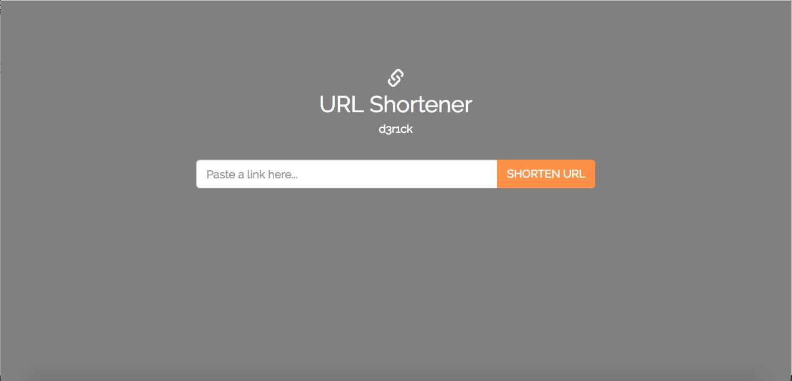
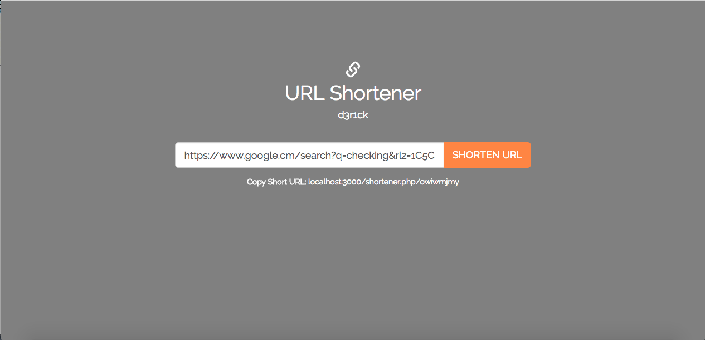

# URL Shortener app with PHP + MySQL / MariaDB

A mini/micro project meant for URL shortening using PHP & MySQL as DBMS.


# Setting up project locally / production


## Clone the repository;

NOTE: Make sure to navigate to your web-server directory (for example `/var/www/html` for Ubuntu OS)

```shell
git clone https://github.com/ch3nkula/url-shortener.git
```


## Install dependencies for the project;

```shell
composer update
```

NOTE: You must have `composer` installed for this to work. To install `composer`, check [the official website](https://getcomposer.org/download/).


## Setup database & it's credentials;

1. Import the `urls.sql` database schema to your database (with name `url_shortener`). You can import using phpMyAdmin or Command-Line for MySQL. Once you import this schema, move straight to setting up credentials.

2. Duplicate the file called `.env.example` and rename the duplicate copy to `.env`

```shell
cp .env.example .env
```

3. In the `.env` file, there are two sections, one for local config and the other for production configs. Fill the section for local configs for example;

```
LOCAL_DB_HOST=<host-name>
LOCAL_DB_USER=<database-user>
LOCAL_DB_PASSWORD=<database-password>
LOCAL_DB_NAME=<database-name>
```


## Run / Test the application locally

Once you are done with the steps above, try to run and test the application using PHP's in-built server.

1. Run the application by typing and executing the command below;

```shell
php -S localhost:3000
```

NOTE: It's important to use port `3000` as it's used in the application.

2. Move over to your favorite browser, mine is `Google Chrome` or `Safari` and test the application by typing in the address bar; `https://localhost:3000`. 

If things work as expected, then you should see this on your browser




## Final Step

If you see the above image, then you are almost there, try pasting a long URL in the form field and see if the app generates a short URL (see image below). If you get a short URL, then it work well. Enjoy!




## License

MIT License